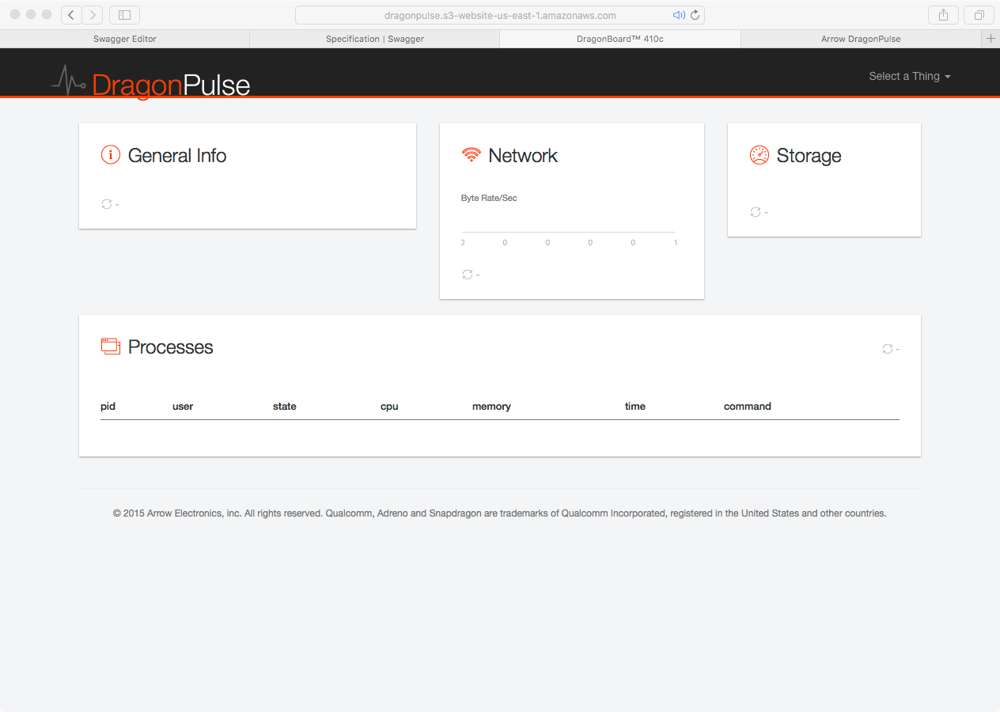

# Visit the Dashboard

Following the previous steps should have the client sending data to
Amazon Web Services and the dashboard displaying those data.  The dashboard
will be available at

http://dragonpulse-${identifier}.s3-website-${region}.amazonaws.com

where the identifier was defined when the
[Dashboard](./../admin/dashboard.html) was created.

Visiting the dashboard should display an image similar to

The dashboard will display general, disk, network, and proces information.
