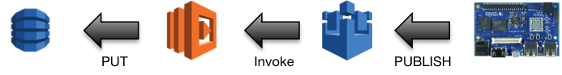

# Introduction

The DragonPulse example collects and displays general, disk, network,
and process information using the information from the operating system

Observation | Utilities
------------|----------
General | uname, lsb_release
Disk | df
Network | ifconfig, iftop
Process | top

## Data Storage

Each datum is stored in a DynamoDB table using the following mechanism

The following steps occur when an data is collected

1.  The data is collected using a JavaScript application running in the
    Node.js engine.
2.  The DragonPulse client application transmits the data to the
    things/+/monitor/* topic using MQTT
3.  The DragonPulse-monitor Lambda function is invoked when a message
    is received on the things/+/monitor/* topic
4.  The DragonPulse-monitor Lambda function stores the data in the
    appropriate DynamoDB table

## Data Presentation

The dashboard displays the data by periodically polling the DragonPulse API.

1.  The web browser makes a request of the /things/{thingId}/monitor/*
    resource.
2.  The API Gateway, when a request is received, invokes the
    DragonPulse-monitor Lambda function.
3.  The DragonPulse-monitor Lambda function queries the appropriate
    DyanmoDB table for the contents.
4.  The web browser interprets the response and displays the appropriate
    data.
